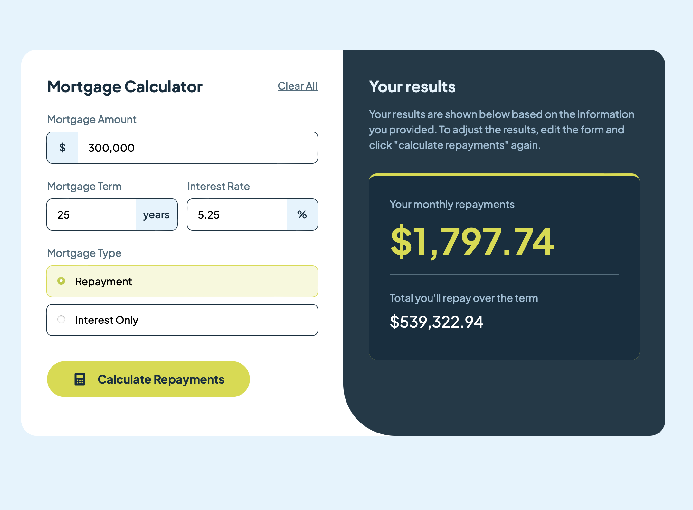

# Frontend Mentor - Mortgage repayment calculator solution

This is a solution to the [Mortgage repayment calculator challenge on Frontend Mentor](https://www.frontendmentor.io/challenges/mortgage-repayment-calculator-Galx1LXK73). Frontend Mentor challenges help you improve your coding skills by building realistic projects.

## Table of contents

- [Overview](#overview)
  - [The challenge](#the-challenge)
  - [Screenshot](#screenshot)
  - [Links](#links)
- [My process](#my-process)
  - [Built with](#built-with)
  - [What I learned](#what-i-learned)
  - [Continued development](#continued-development)
  - [Useful resources](#useful-resources)
- [Author](#author)

## Overview

### The challenge

Users should be able to:

- Input mortgage information and see monthly repayment and total repayment amounts after submitting the form
- See form validation messages if any field is incomplete
- Complete the form only using their keyboard
- View the optimal layout for the interface depending on their device's screen size
- See hover and focus states for all interactive elements on the page

### Screenshot



### Links

- Solution URL: [https://github.com/Jake-Oz/mortgage-calculator](https://github.com/Jake-Oz/mortgage-calculator)
- Live Site URL: [https://mortgage-calculator-ten-beryl.vercel.app](https://mortgage-calculator-ten-beryl.vercel.app)

## My process

### Built with

- [React](https://reactjs.org/) - JS library
- [Next.js](https://nextjs.org/) - React framework
- [Tailwind](https://tailwindcss.com/) - For styles

### What I learned

Spent a lot of time learning more about React-Hook-Form and Zod to validate the form.
I also have started using children components more often to make the code more readable and easier to manage such as Container components as you can see below.

```tsx
<Container className="lg:bg-White lg:max-w-[1000px] max-w-[500px] lg:max-h-[600px] flex lg:flex-row flex-col ">
        <Container className="flex flex-col justify-center items-center gap-6 bg-White lg:min-w-[500px] min-w-[375px] min-h-[600px] px-6 py-10 lg:p-10">
          <Header handleClick={handleClick} />
          <Input
            className="place-content-center"
            onSubmit={onSubmit}
            resetState={resetState}
            setResetState={setResetState}
          >
            <Button
              type="submit"
              tabIndex={0}
              className="h-14 rounded-full w-full lg:w-3/4 mt-4 flex justify-center items-center px-4 "
            >
              <div className="flex justify-center items-center gap-4">
                <Image
                  src="/icon-calculator.svg"
                  alt="calculator icon"
                  width={24}
                  height={24}
                />
                <p>Calculate Repayments</p>
              </div>
            </Button>
          </Input>
        </Container>
```

### Continued development

I will focus on Components as Props and optimising re-renders to enhance performance.

### Useful resources

- [Intro to Re-Renders](https://www.youtube.com/watch?v=qTDnwmMF5q8&t=15s) - This helped me understand some more advanced React topics.

## Author

- Frontend Mentor - [@Jake-Oz](https://www.frontendmentor.io/profile/Jake-Oz)
